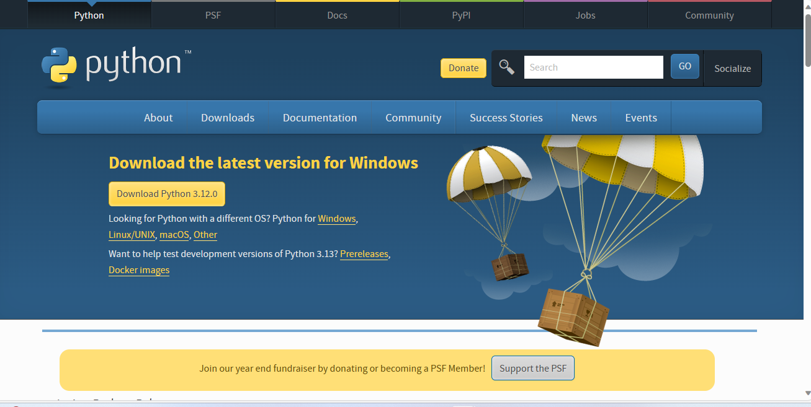

# LibraryManagementSystem

## Installation Steps
1. Make sure to have the latest version of python installed 
   1. Visit https://www.python.org/downloads/ and click downloads
   2. 
2. Install Tkinter by running the command (``pip install tk``) on windows
   1. 
3. For mac run ``/bin/bash -c "$(curl -fsSL https://raw.githubusercontent.com/Homebrew/install/HEAD/install.sh)"``
   1. Then run ``brew install python-tk``
4. In the command prompt, run the program with the command ``python3 FileName.py``
   1. For ex ``python3 addressBOOK.py``
   2. If that doesnt work try ``python addressBOOK.py``
      1. 